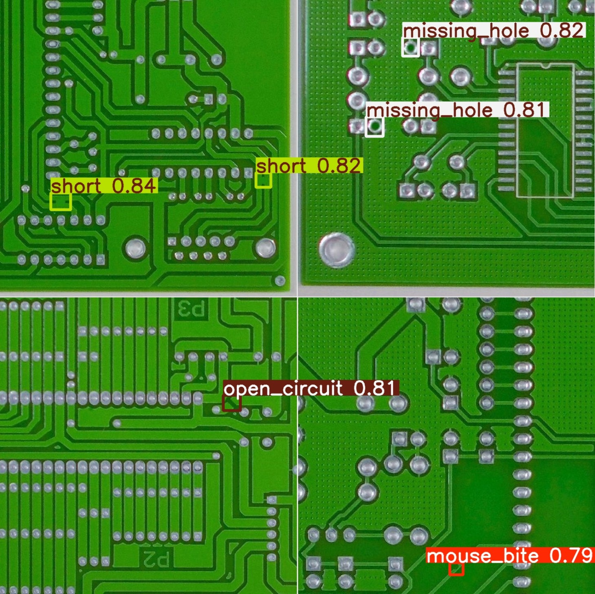
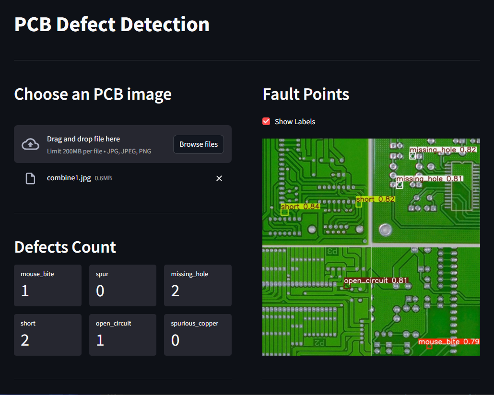
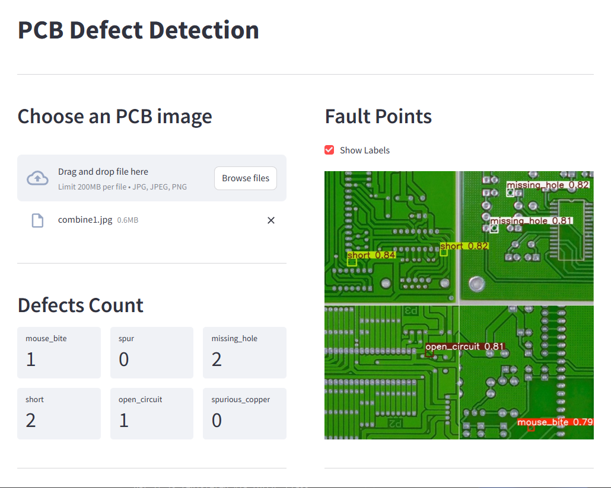
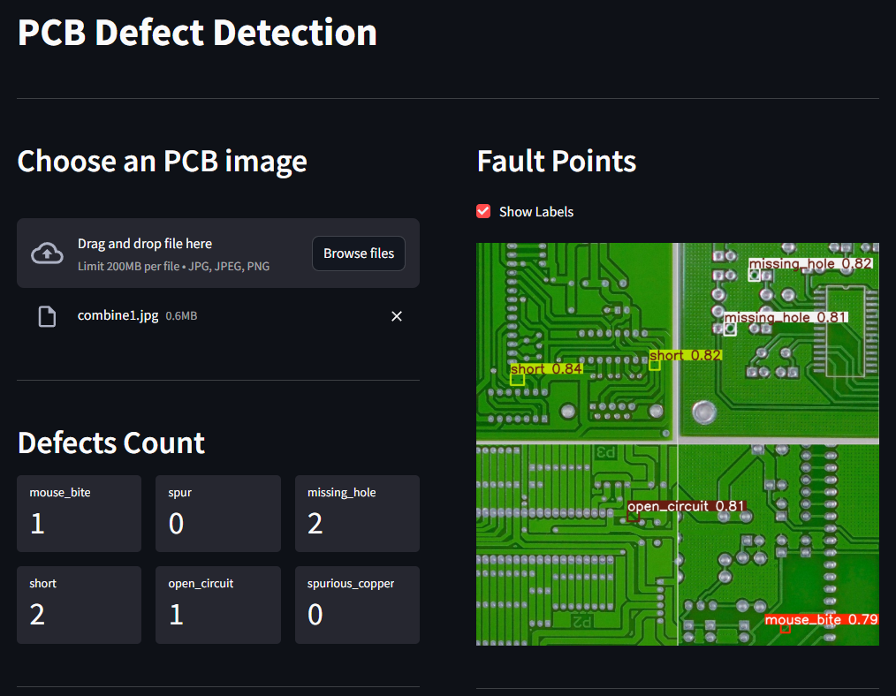

# PCB Defect Detection

This is our final project for the Computer Vision course at NCHU, Fall 2024. We use the `YOLOv11s` model to detect defects on printed circuit boards (PCBs). With an mAP50 of 0.995, the model achieves exceptional accuracy and demonstrates high inference speed.



## App Screenshot
Dark | Light
:---:|:----:
 | 

## Files

[`main.ipynb`](main.ipynb): Code for training the PCB defect detection model and evaluating it on the test set.

[`app.py`](app.py): Code for the Streamlit app, which allows users to upload an pcb image and view the defect detection results.

[`pcb_defect/`](pcb_defect/): Directory containing the trained model and log files.

[`download_dataset.sh`](download_dataset.sh): Bash script for downloading the dataset.

[`requirements.txt`](requirements.txt): List of Python packages required to run the code.

## Installation

### The environment used in this project:
  - OS: Linux Mint 22
  - Python: 3.11.10

### Step 1. Clone this repo.
  ```bash
  git clone --depth 1 --no-checkout https://github.com/devilhyt/pcb-defect-detection.git
  
  cd pcb-defect-detection
  ```

### Step 2. Download the dataset.
  ```bash
  bash download_dataset.sh
  ```

### Step 3. Check the Python version.
  ```bash
  python --version
  ```

### Step 4. Install all dependencies.
  ```bash
  pip install -r requirements.txt
  ```
  
### Step 5. Open and view the [`main.ipynb`](main.ipynb) file.
  - This notebook contains the code for training the PCB defect detection model and evaluating it on the test set.
  - If you plan to train the model, you can choose to enable or disable Weights & Biases logging.
    ```bash
    # Enable Weights & Biases logging
    wandb enabled

    # Disable Weights & Biases logging
    wandb disabled
    ```
  - If you choose to enable Weights & Biases logging, you need to authenticate your account.
      ```bash
      wandb login
      ```


### Step 6. Run the Streamlit server.
  ```bash
  streamlit run app.py
  ```
  - The server is running on http://localhost:8501
  - Streamlit will just increment the port number to 8502, 8503, etc. if 8501 is in-use.

<!-- ## App Screenshot
   -->

## Acknowledgements
- Special thanks to **Albert C.M. Yang**, our instructor, for his guidance, valuable feedback, and support throughout the development of this project.
- Libraries:
  - [YOLOv11](https://docs.ultralytics.com/models/yolo11/)
  - [Streamlit](https://streamlit.io/)
- Dataset:
  - [PCB Defect dataset](https://github.com/Ixiaohuihuihui/Tiny-Defect-Detection-for-PCB)
  - [PCB Defect dataset (YOLO format)](https://www.kaggle.com/datasets/norbertelter/pcb-defect-dataset)

## Contributors
- HsiangYi Tsai, [devilhyt](https://github.com/devilhyt) on Github (Author)
- Andy Chen, [chenchenchenabc](https://github.com/chenchenchenabc) on Github (Author)